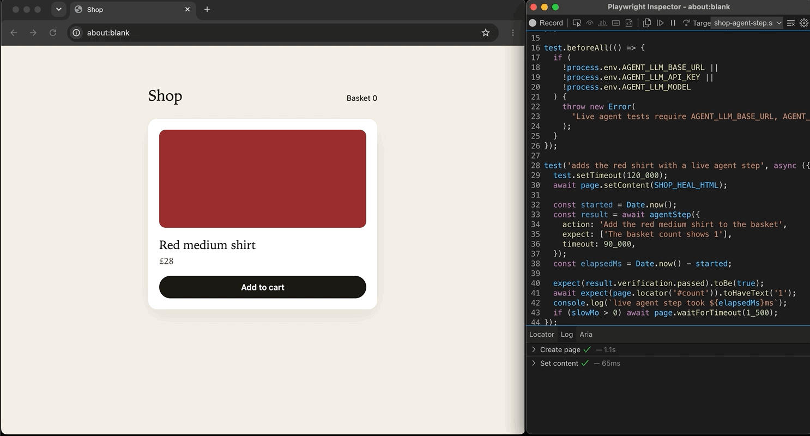

# @sayer/agent-step

[](https://www.npmjs.com/package/@sayer/agent-step)
[](https://www.npmjs.com/package/@sayer/agent-step)

`@sayer/agent-step` is a Playwright fixture for agent steps you mix with locators and assertions.

You keep writing Playwright as usual. When a bit of the UI is annoying to locate, you hand that part to `agentStep` in plain English, then assert the result yourself. When a class, attribute, or page-object locator misses, `agentHealFixture` repairs that locator and writes a patch you can apply.



```ts
await agentStep({
  action: 'Add the red medium shirt to the basket',
  expect: ['The basket badge shows 1'],
});

await expect(page.locator('#badge')).toHaveText('1');
```

It drives the test's existing `page`. It does not spin up another browser or go through Playwright MCP.

## Installation

```bash
npm install @sayer/agent-step
```

Add `-D` if you only use it in tests. `@playwright/test` is a peer dependency (1.63+). Needs an OpenAI-compatible model that can do tool calling. OpenRouter works.

## Add it as a fixture

This is the bit you want. Put this in `tests/fixtures.ts` so it sits next to your other fixtures:

```ts
import { test as base, expect } from '@playwright/test';
import {
  agentStepFixture,
  type AgentStepFixtures,
} from '@sayer/agent-step';

export const test = base.extend<AgentStepFixtures>(agentStepFixture);
export { expect };
```

Then import `test` from there, not from `@playwright/test`:

```ts
import { test, expect } from './fixtures';

test('checkout', async ({ page, agentStep }) => {
  await page.goto('/shop');

  await agentStep({
    action: 'Add the red medium shirt to the basket',
    expect: [
      'The basket badge shows 1',
      'The basket contains the red medium shirt',
    ],
  });

  await expect(page.locator('#badge')).toHaveText('1');
});
```

`action` is what to do. `expect` is what should be true afterwards. Those are checked separately so the model that clicked around is not also marking its own homework.

## Or call it directly

If you do not want a fixture, keep the normal Playwright import and pass `page` in:

```ts
import { test, expect } from '@playwright/test';
import { agentStep } from '@sayer/agent-step';

test('checkout', async ({ page }) => {
  await page.goto('/shop');

  await agentStep(page, {
    action: 'Add the red medium shirt to the basket',
    expect: ['The basket contains the red medium shirt'],
  });
});
```

## Env

Set these where you run Playwright. The package reads `process.env` and does not load `.env` for you.

```bash
export AGENT_LLM_BASE_URL=https://openrouter.ai/api/v1
export AGENT_LLM_API_KEY=sk-or-...
export AGENT_LLM_MODEL=openai/gpt-4o-mini
```

`AGENT_LLM_BASE_URL` is the API root. Do not put `/chat/completions` on the end.

Set `AGENT_STEP_DEBUG=true` to print each model request and response, and whether a heal was repaired from the DOM or sent to the model. The API key is not printed. Long snapshots are truncated.

Same shape works for OpenAI (`https://api.openai.com/v1`) or anything else that speaks Chat Completions with tools.

The model has to support tool calling. If you get "no choices" back, it is usually the model slug or tools not being supported.

Tested models:

| Model |
| --- |
| `gpt-6-luna` |
| `gpt-5.6-luna` |
| `gpt-6-sol` |

## Custom headers

Pass extra LLM headers when you create the step. Values have to be strings. They go out on every model request for that factory, including verification.

```ts
import { test as base, expect } from '@playwright/test';
import {
  createAgentStep,
  type AgentStepFixtures,
} from '@sayer/agent-step';

export const test = base.extend<AgentStepFixtures>({
  agentStep: async ({ page }, use, testInfo) => {
    await use(
      createAgentStep({
        page,
        testInfo,
        headers: {
          'X-Title': 'checkout-tests',
        },
      }),
    );
  },
});

export { expect };
```

A header you set replaces the built-in `HTTP-Referer` or `X-OpenRouter-Title` when the name matches. `agentStepFixture` does not take headers. Use `createAgentStep` in your fixture when you need them.

## Secrets

Do not put passwords in the prompt. Use a placeholder and pass the real value in `secrets`:

```ts
await agentStep({
  action: 'Sign in with the test account email',
  expect: ['Signed in as the test account email'],
  secrets: { EMAIL: process.env.TEST_EMAIL! },
});
```

In the action, tell it to type `%EMAIL%`. The value is filled in the browser and redacted from reports.

## Timeout

Each step gets 60 seconds for the action plus verification. Pass `timeout` in milliseconds if you need longer. This still throws when `soft` is true. It is the agent budget, not Playwright's test timeout, so raise that too if the step can run long.

```ts
await agentStep({
  action: 'Add the red medium shirt to the basket',
  expect: ['The basket badge shows 1'],
  timeout: 120_000,
});
```

## Heal a broken Playwright locator

Extend Playwright's `page` when a test uses class or DOM locators. If an action cannot find its locator, or the locator matches more than one element, healing snapshots the page, retries that action once, and writes a patch you can apply afterward. The spec is not edited during the run.

```ts
import { test as base, expect } from '@playwright/test';
import { agentHealFixture } from '@sayer/agent-step';

export const test = base.extend(agentHealFixture);
export { expect };

test('checkout', async ({ page }) => {
  await page.locator('.add-to-basket').click();
});
```

A page object works when its locators are created from that `page`. A selector such as `.header .body-custom-name:visible .sub-element .blah` is repaired at the segment that stopped matching, and the patch points at the page-object line. A single CSS locator is patched to a unique id, or to a unique class whose name still resembles the old selector. Otherwise the patch uses `getByRole` when that role and name match one element. If no replacement is unique, the action can still pass and no patch is written. The patch is `agent-heal.patch` in that test's output folder. Apply it with `git apply`.

```bash
git apply test-results/**/agent-heal.patch
```

An assertion failure, or a timeout after Playwright has already resolved the element, still throws. If the snapshot has no single match, the original error throws too. `agentStepFixture` does not include healing.

## Check without an action

Leave out `action` when the page is already in the state you want to judge. The model does not click or type. It only reads the page and checks `expect`.

```ts
await agentStep({
  expect: ['The order total equals the sum of the line items'],
});
```

Use this when the numbers or layout are not stable enough for a locator, but the relationship on the page should still hold. Formatting and position can differ. If the snapshot does not contain the values, the check fails.

## Soft verification

By default a failed `expect` throws. Pass `soft: true` to attach the miss and continue, so later Playwright assertions can still run. Timeouts and tool errors still throw.

```ts
await agentStep({
  action: 'Add the red medium shirt to the basket',
  expect: ['The basket badge shows 1'],
  soft: true,
});

await expect(page.locator('#badge')).toHaveText('1');
```

## How it behaves

Each `agentStep` is a Playwright `test.step`. It snapshots the page, does a small allowlisted set of actions (`browser_click`, `browser_type`, etc), then asks the model again whether the `expect` lines hold. Transcripts and failures get attached to the report.

It will not run arbitrary JS or leave the current origin. Retries are off so it does not click pay twice.

This is not a replacement for Playwright assertions. Use `expect` for anything you actually care about. Pin the model in CI. It will cost tokens and it will flake more than a locator.

## Links

- npm: [npmjs.com/package/@sayer/agent-step](https://www.npmjs.com/package/@sayer/agent-step)
- Source: [github.com/Sayer122/agent-step](https://github.com/Sayer122/agent-step)
